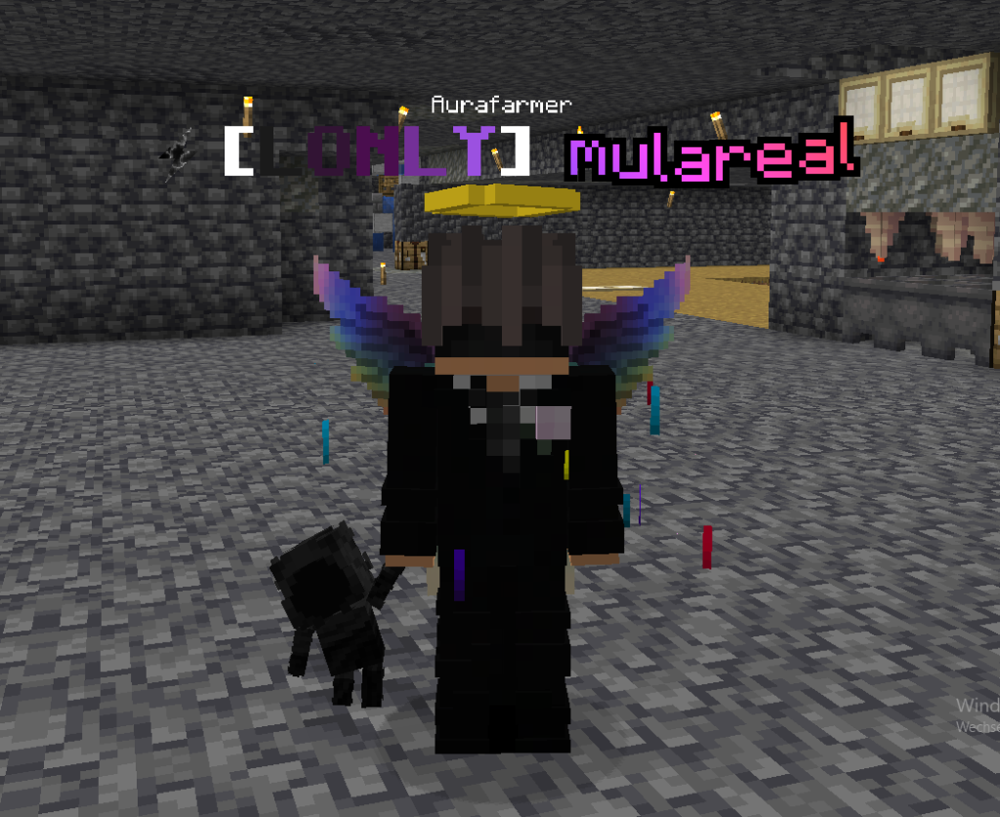
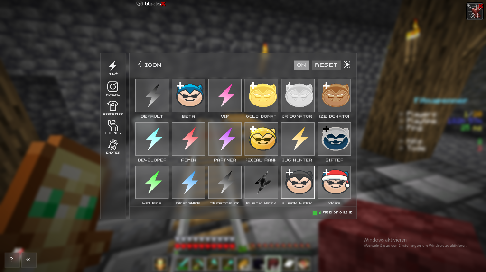
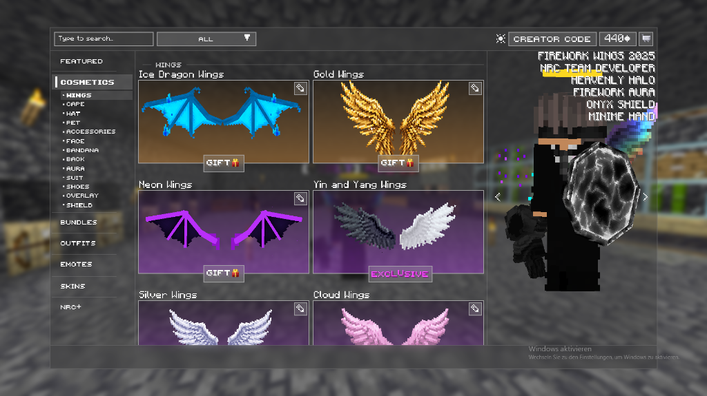
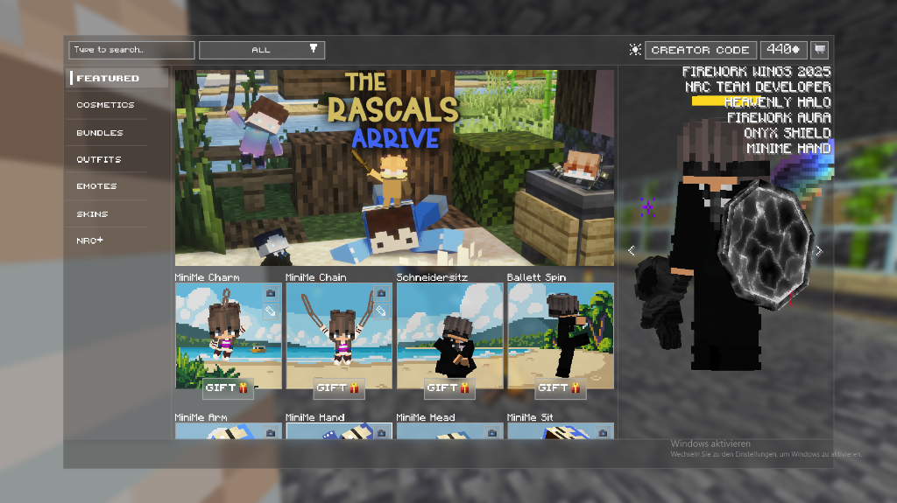

<div align="center">
  

  # NoRisk Cosmetics Unlocker

  A lightweight Fabric mod for NoRisk Client that unlocks all cosmetics, emotes, badges, and NRC+ perks.

  [**Download .jar**](releases/norisk-cosmetics-unlocker-1.0.3.jar) • [**Installation**](#installation) • [**Commands**](#commands) • [**Screenshots**](#screenshots)
</div>

---

## Screenshots

<div align="center">
  
  
</div>
<div align="center" style="margin-top: 10px;">
  
  
</div>

---

## Features
- **All Cosmetics**: Unlocks all wings, capes, halos, hats, masks, pets, and tails in the wardrobe.
- **All Emotes**: Full access to all emotes.
- **All Badges & Crowns**: Choose from all 23 nametag icons.
- **NRC+ Perks**: Custom crosshair editor, projectile particle trails, and nametag formatting.

## Installation
1. Download [`norisk-cosmetics-unlocker-1.0.3.jar`](releases/norisk-cosmetics-unlocker-1.0.3.jar).
2. Press `Win + R`, paste this path and press Enter:
   ```
   %APPDATA%\norisk\NoRiskClientV3\data\profiles\Fabric 26.2\mods
   ```
3. Put the `.jar` file into that folder.
4. Restart your game.

## Commands
Change your nametag icon anytime via chat (or just use the ui):

| Command | Icon |
| :--- | :--- |
| `/nrcicon vip` | VIP Crown |
| `/nrcicon gold` | Gold Donator Crown |
| `/nrcicon silver` | Silver Donator Crown |
| `/nrcicon bronze` | Bronze Donator Crown |
| `/nrcicon dev` | Developer Badge |
| `/nrcicon admin` | Admin Badge |
| `/nrcicon partner` | Partner Badge |
| `/nrcicon special` | Special Rank |
| `/nrcicon bug` | Bug Hunter |
| `/nrcicon default` | Default NoRisk Logo |

Type `/nrcicon` to see your currently selected icon.

## License
MIT
